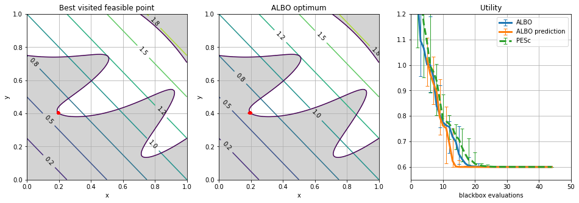

ALBO is an experimental application of Augmented Lagrangians for constrained Bayesian Optimization implemented in BoTorch

Toy problem from Gramacy et al. 2016



Simulation 1 from Gardner et al. 2014


## Algorithm

See [report draft](report/report_draft.ipynb) for details

## Installation
```
git clone https://github.com/stys/albo
cd albo
conda env create -f environment.yml
conda activate albo
pip install -e .
```

## Usage

This package provides alternatives to `ConstrainedMCObjective` for constrained optimization with Ax and
TorchModelBridge.

Step 1: choose one of available ALBO objectives, i.e. `ClassicAlboMCObjective`

```
from albo.objective import ClassicAlboMCObjective
```

Step 2: create an instance `AlboAcquisitionFactory` which implements the inner loop of ALBO algorithm
and use it to combine ALBO objective with one of the common acquisition functions. Use `qEI` for explorative
phase of optimization and then use `qSR` for a few steps to drill to the optimal point (usually at the
border of the constraints).

```
from albo.acquisition import AlboAcquisitionFactory

acqf_constructor = AlboAcquisitionFactory(
    albo_objective_constructor=ClassicAlboMCObjective,
    acquisition_function_name=`qEI`,
    bounds=bounds,
    init_mults=init_mults,
    init_penalty_rate=penalty_rate,
    num_iter=num_iter_inner,
    num_restarts=1
)
```

Step 3: use this instance as a custom acquisition function constructor with TorchModelBridge
```
from ax.modelbridge.factory import get_botorch

model = get_botorch(
    experiment=experiment,
    search_space=search_space,
    data=exp.fetch_data(),
    acqf_constructor=acqf_constructor
)
```

See examples of full optimization loops:


